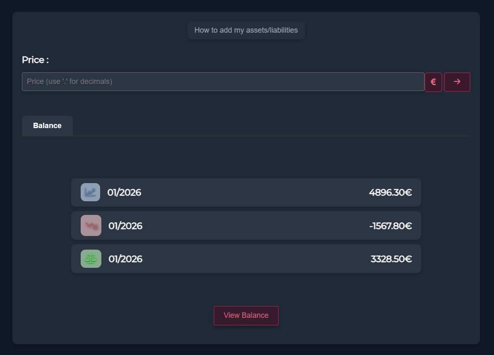
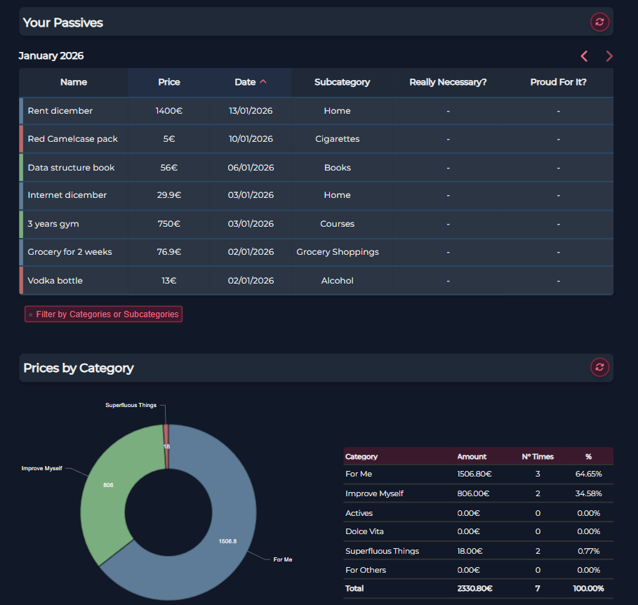
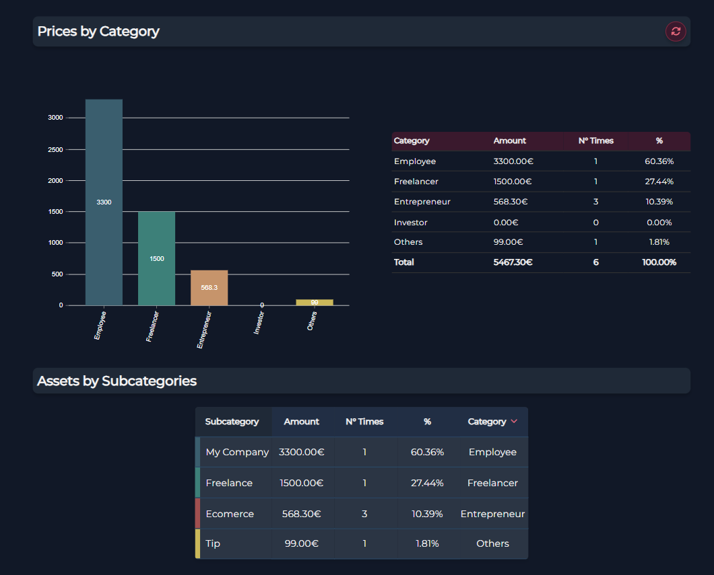
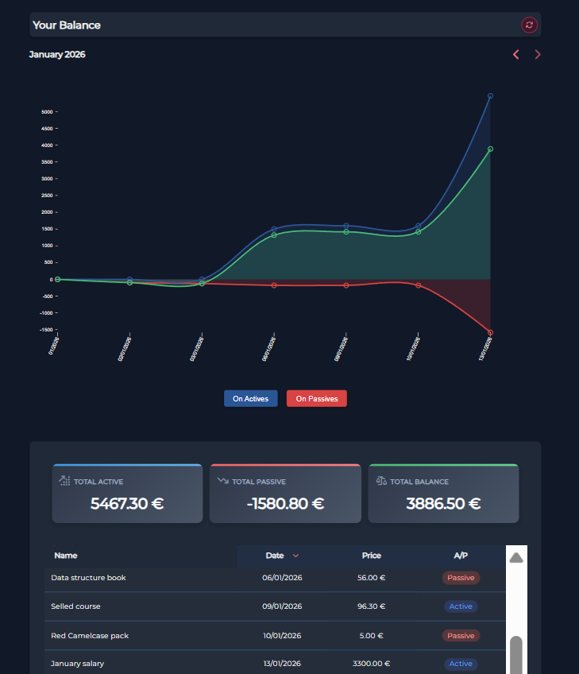
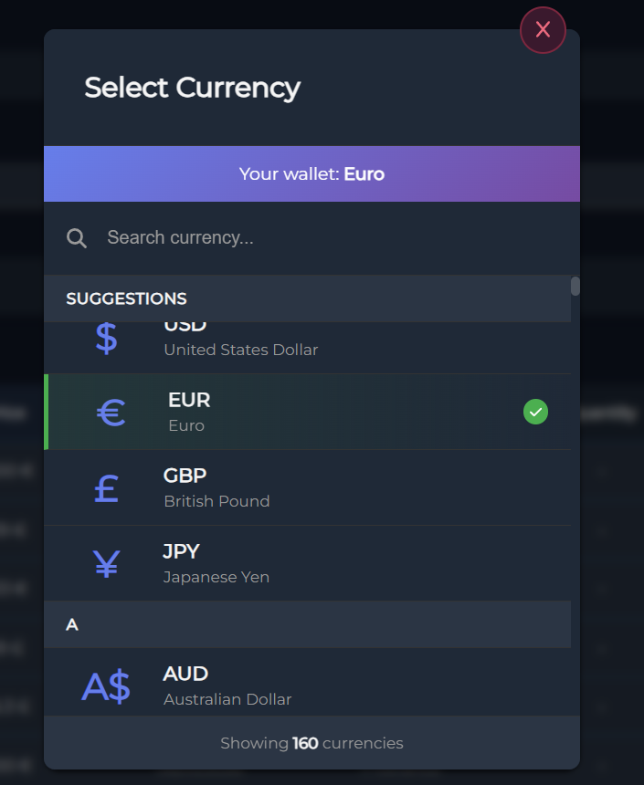
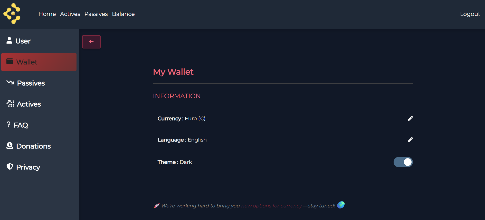

# 💰 Inco.cash - Smart Financial Management Platform

> Multi-language, multi-currency financial tracking system serving 200+ users across 6 countries

🔗 **[inco.cash](https://inco.cash)** | 👥 200+ Users | 🌍 7 Languages | 💱 6 Currencies | 📊 Production

---

## 📸 Platform Overview

### Dashboard - Monthly Balance Overview

_Real-time balance tracking with quick-add functionality and visual diagrams.
Budget, Stock, and Mission views coming soon._

### Liabilities (Expenses) - Category Analysis

_Comprehensive expense tracking with interactive charts, category filtering, and subcategory breakdown_

### Assets (Income) - Cash Flow Quadrants

_Income management based on Robert Kiyosaki's Cash Flow Quadrant methodology with filtering capabilities_

### Balance Analysis - Multi-Period View

_Financial balance visualization with monthly, quarterly, four-monthly, semi-annual, and annual period selection_

### Multi-Currency Support

_Real-time currency conversion with automatic daily exchange rate updates_

### Profile & Settings

_Theme customization and language selection across 7 languages_

**Additional pages coming soon:** Budget Management, Stock Portfolio, Mission System

---

## ⚡ What Makes Inco.cash Special

### 🌍 **Truly International**

- **7 languages** (EN, ES, IT, FR, PL, RU, PT) with custom-built i18n system (5,000+ translations)
- **6 currencies** with daily automated exchange rates (EUR, USD, COP, PEN, PLN, RUB)
- Real-time currency conversion at transaction time

### 💡 **Behavioral Design**

- **11 strategic categories** designed to promote better financial habits
- Based on Robert Kiyosaki's Cash Flow Quadrant for income tracking
- Categories encourage awareness: "For Me" vs "Superfluous Things"

### 🎨 **User-Centric Experience**

- Theme customization
- Interactive Nivo charts (pie, bar, balance diagrams)
- Responsive design for all devices
- Unlimited custom subcategories
- Advanced filtering by categories and subcategories

### 🔐 **Production-Grade Engineering**

- JWT authentication with refresh tokens
- **Data encryption at rest** (transaction names and amounts)
- Flyway database migrations
- Automated daily schedulers (exchange rates + token cleanup)
- Email-based password recovery
- Google Analytics integration
- 99.5% uptime serving 200+ users

---

## 🛠️ Tech Stack

**Frontend:** React (Vanilla JS) • Redux • Nivo • CSS Modules • Custom i18n (5,000+ translations)

**Backend:** Java 17 • Spring Boot 3.x • MySQL • Flyway Migrations • JWT • Scheduled Tasks • AES Encryption

**Infrastructure:** Contabo VPS • SSL/HTTPS • Daily Schedulers

**Integrations:** Currency Exchange API (6 pairs) • Email Service (SMTP) • Google Analytics

---

## 💰 Category System

### Liabilities (6 Categories)

Designed to motivate improvement and financial awareness:

1. **For Me** 🏠 - Essential survival expenses (rent, transport, internet)
2. **Improve Myself** 📚 - Self-improvement investments (courses, gym, therapy)
3. **Dolce Vita** ✈️ - Pleasure expenses that make life sweet (travel, concerts, spa)
4. **Actives** 💻 - Income-generating purchases (laptop, tools, advertising)
5. **Superfluous Things** 🚬 - Unnecessary, potentially harmful (alcohol, cigarettes, gambling)
6. **For Others** 🎁 - Expenses toward others (gifts, donations, pets)

### Assets (5 Categories - Cash Flow Quadrant)

Based on Robert Kiyosaki's "The Cashflow Quadrant":

1. **Employee (E)** 💵 - Employment income (salary, bonuses, overtime)
2. **Freelancer (S)** 📝 - Self-employed income (projects, consulting, design)
3. **Entrepreneur (B)** 🛍️ - Business owner income (sales, services, subscriptions)
4. **Investor (I)** 💹 - Investment returns (dividends, rents, interest)
5. **Others** 🏆 - Extraordinary income (refunds, prizes, gifts)

**Each category supports unlimited user-defined subcategories.**

---

## 🚀 Key Features

### Financial Tracking

- **Time-based filtering:**
  - Assets/Liabilities: Current month (default) with month selector for historical data
  - Balance page: Multiple period views (quarterly, four-monthly, semi-annual, annual)
- **Advanced filtering:** Filter transactions by category or subcategory
- Three-section view per page: transaction table, visual charts, subcategory analysis
- Real-time balance calculations with interactive diagrams

### Data Visualization

- Interactive Nivo charts (pie, bar)
- Real-time balance diagrams across multiple time periods
- Category breakdown with percentages and amounts
- Toggle between chart types
- Period comparison views

### Internationalization

- 7 languages without third-party libraries
- 5,000+ custom translations
- Modular architecture for easy expansion
- German coming soon (8th language)

### Multi-Currency System

- **6 currencies with full exchange support:**
  - 🇪🇺 EUR (Euro) - Italy, Poland
  - 🇺🇸 USD (US Dollar) - USA
  - 🇨🇴 COP (Colombian Peso) - Colombia
  - 🇵🇪 PEN (Peruvian Sol) - Peru
  - 🇵🇱 PLN (Polish Zloty) - Poland
  - 🇷🇺 RUB (Russian Ruble) - Russia
- Daily automated exchange rate synchronization (14:20 UTC)
- Real-time client-side conversion using latest rates
- Amounts stored securely in user's wallet currency

### Security & Privacy

- **Data encryption at rest:** Transaction names and amounts encrypted at database level
- JWT with refresh tokens (15min access, 7 day refresh)
- Automated daily token cleanup (2 AM)
- BCrypt password hashing
- Email-based password reset
- User data isolation
- Privacy-first design (built for fellow programmers)

### User Management

- Google Analytics integration for usage insights
- Performance monitoring
- User behavior tracking (privacy-respecting)

---

## 🗺️ Roadmap

### ✅ Completed

- Multi-currency system with daily automated sync (6 currencies)
- Custom 7-language internationalization (5,000+ translations)
- JWT authentication with refresh token mechanism + automated cleanup
- Data encryption for sensitive fields (names, amounts)
- 11 behavioral categories (6 liabilities + 5 assets) with unlimited subcategories
- Advanced filtering by category and subcategory
- Multi-period balance analysis (quarterly, semi-annual, annual)
- Interactive data visualization with Nivo
- Flyway database migrations
- Email-based password reset
- Theme customization
- Google Analytics integration
- 200+ active users across 6+ countries

### 🚧 In Progress (Q1 2026)

- **Budget Management System** - Create/manage budgets, track vs actual, alerts
- **Import/Export** - CSV/Excel/PDF export, bulk transaction imports
- **German Language** - 8th language support (5,000+ translations)
- **Enhanced Multi-Currency** - Dual storage (original + converted amounts) for historical accuracy

### 📋 Coming Next (Q2 2026)

- **Recurring Transactions** - Set up automatic monthly income/expenses
- **Stock Portfolio Tracking** - Investment tracking with real-time prices
- **Mission System** - Financial goals with gamification elements

### 🔮 Future Vision (Q3-Q4 2026)

- Mobile app (React Native)
- AI-powered insights & predictions
- Social login (Google, Facebook, Apple)
- Bank integration & automatic imports

**[View Detailed Roadmap →](./ROADMAP.md)**

---

## 💡 Technical Highlights

### Custom Internationalization System

Built from scratch without third-party libraries. 5,000+ translations managed in custom architecture, supporting 7 languages with German in development.

### Multi-Currency Architecture

Daily automated scheduler (14:20 UTC) syncs exchange rates for 6 currency pairs. Client-side conversion using latest rates, with secure encrypted storage in user's wallet currency.

### Data Encryption & Privacy

Transaction names and amounts encrypted at database level using AES encryption. Originally implemented to protect privacy of first users (fellow programmers), now a core security feature for all 200+ users.

### Production Engineering

- **Flyway** for database version control and safe migrations
- **Automated schedulers**: Exchange rate sync (14:20 UTC) + Token cleanup (2 AM)
- **JWT refresh token strategy** balancing security with user experience
- **Service layer pattern**: Interface/Implementation separation for clean architecture
- **Google Analytics**: User behavior insights and performance monitoring
- **99.5% uptime** serving 200+ international users

### Behavioral Design Philosophy

Categories based on financial education principles (Cash Flow Quadrant) to promote awareness, encourage better habits, and motivate improvement.

---

## 🎯 Why This Project Matters

This is **not a demo or tutorial project** - it's a production application serving 200+ real users managing real finances daily across 6 countries and 7 languages.

**Demonstrates:**

✅ **Full-Stack Ownership** - Complete control from database design to UI implementation

✅ **Complex Problem-Solving** - Multi-currency conversion, custom i18n system, behavioral category design

✅ **Production Engineering** - Flyway migrations, automated schedulers, JWT security, data encryption, email integration

✅ **Security & Privacy Focus** - Database-level encryption, privacy-first architecture

✅ **Real-World Scale** - 200+ users, international distribution, continuous uptime

✅ **Continuous Development** - Active roadmap with Budget, Stock, Mission systems planned

---

## 📚 Deep Dive Documentation

Want to explore the technical implementation in depth?

### 📖 [Complete Technical Documentation →](./TECHNICAL.md)

Detailed coverage of:

- System architecture diagrams
- Database schema design (Flyway migrations)
- Encryption implementation details
- API endpoint structure
- Service layer organization (Interface/Implementation pattern)
- Development challenges & solutions
- Security implementation details
- Performance metrics & optimization
- Frontend architecture (Redux, Nivo, CSS Modules)
- Backend implementation (Spring Boot, Schedulers, JWT)
- Real code structure and design patterns

### 🗺️ [Detailed Roadmap & Features →](./ROADMAP.md)

Complete feature specifications:

- Timeline and priorities
- Technical requirements
- Implementation details
- Budget Management System specs
- Recurring transactions design
- Stock Portfolio Tracking design
- Mission System gamification
- Import/Export functionality
- Enhanced multi-currency (dual storage)

### 🌐 [Try Live Application →](https://inco.cash)

Explore the platform yourself:

- Available in 7 languages
- Create account and test features
- Experience multi-currency conversion
- View all 11 categories
- Interactive charts and visualizations
- Advanced filtering capabilities

---

## 💬 Let's Talk

Interested in discussing the technical implementation, architecture decisions, or seeing a detailed walkthrough?

📧 **Email:** frankfarfan96@gmail.com  
💼 **LinkedIn:** [linkedin.com/in/francesco-farfan-88857b232](https://www.linkedin.com/in/francesco-farfan-88857b232/)  
🌐 **Live Demo:** [inco.cash](https://inco.cash)

---

## 📝 About This Repository

This is a **portfolio showcase** for a production financial management application that I've architected, built, and maintained independently.

**The codebase is private to:**

- Protect intellectual property
- Secure user data and business logic
- Maintain future monetization options

**During interviews, I'm happy to:**

- Walk through the live application in any of 7 languages
- Explain architecture decisions and reasoning behind technical choices
- Discuss challenges faced and solutions implemented
- Detail production experience and lessons learned

_Code samples available upon request for serious opportunities._

---

**Built with passion and precision by Francesco Farfan**

_From concept to production • From 1 language to 7 • From 1 currency to 6 • From 1 user to 200+_

_Still growing • Still improving • Still coding_ 🚀
